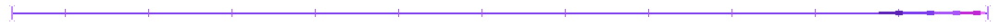
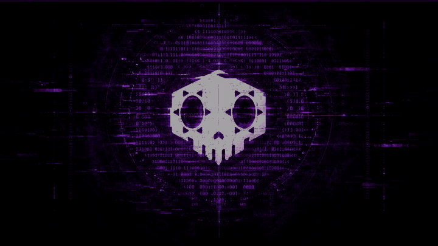

 
<picture>
<source media="(prefers-color-scheme: dark)" srcset="https://readme-typing-svg.demolab.com/?font=Fira+Code&amp;size=22&amp;duration=4000&amp;pause=1400&amp;color=E9D5FF&amp;center=true&amp;vCenter=true&amp;width=920&amp;height=54&amp;lines=Hey+%3A%29;Build+secure.+Break+smart.+Learn+constantly.;Always+learning%2C+building%2C+breaking%2C+and+rebuilding+better" />

</picture>
<!--  

  -->

<h1>Hey :)</h1>
<h3>👨‍💻 About Me</h3>

🎓 Pre-Final Year B.Tech CSE student at <strong>National Institute of Technology, Hamirpur</strong> 
🔐 Passionate about <strong>building secure &amp; scalable systems — and breaking the weaker ones</strong> 
🛡️ <strong>Domain Lead @ SHIELD</strong>, the Cybersecurity Society of NIT Hamirpur 
💻 Currently sharpening my skills in <strong>Software Development, System Security &amp; Cybersecurity</strong> 
🚀 Interested in <strong>Cybersecurity, Full-Stack Development, AI Systems &amp; Networking</strong> 
🧠 Always learning, building, breaking, and rebuilding better 
⚡ <em>Build secure. Break smart. Learn constantly.</em>

<h2>🌐 Socials:</h2>
&nbsp;&nbsp;
&nbsp;&nbsp;

  
&nbsp;&nbsp;
&nbsp;&nbsp;

  
<h1>💻 Tech Stack:</h1>
&nbsp;
&nbsp;
&nbsp;
&nbsp;
&nbsp;

 
&nbsp;
&nbsp;
&nbsp;
&nbsp;
&nbsp;

 
&nbsp;
&nbsp;
&nbsp;
&nbsp;
&nbsp;

 
&nbsp;
&nbsp;
&nbsp;
&nbsp;
&nbsp;

 
&nbsp;
&nbsp;
&nbsp;
&nbsp;
&nbsp;

 
&nbsp;
&nbsp;
&nbsp;
&nbsp;
&nbsp;

 
&nbsp;
&nbsp;
&nbsp;
&nbsp;
&nbsp;

 
&nbsp;
&nbsp;
&nbsp;
&nbsp;
&nbsp;

 
&nbsp;
&nbsp;
&nbsp;
&nbsp;
&nbsp;

 
&nbsp;
&nbsp;
&nbsp;
&nbsp;
&nbsp;

 
&nbsp;
&nbsp;
&nbsp;

<h1>📊 GitHub Stats:</h1>

  

 
<h2>🏆 GitHub Trophies</h2>

 
<h3>✍️ Random Dev Quote</h3>

  

